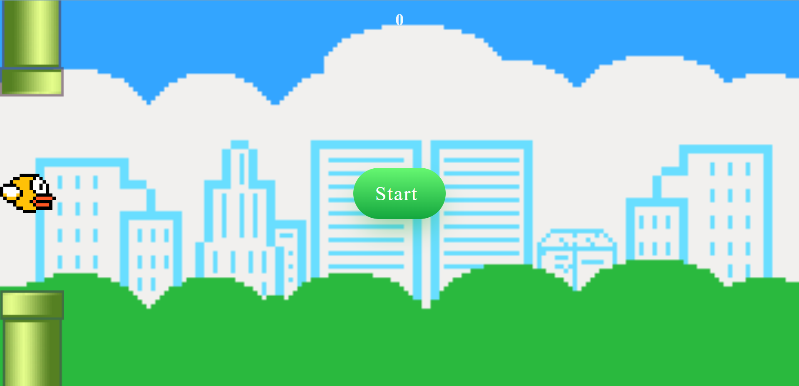

# 🐦 Flappy Bird Clone

This game is a recreation of the famous **Flappy Bird** game, originally created by **Nguyễn Hà Đông**.

### Credits

- Original game created by **Nguyễn Hà Đông**.
- This project is a copy made for educational purposes, not for commercial use.

A simple yet polished **Flappy Bird-style game** built with **HTML**, **CSS**, and **JavaScript**.  
Fly through obstacles, score points, and enjoy smooth animations with realistic gravity and motion physics.

---
## Deploy
https://whandger.github.io/FlappyBird-Genre-2d-game/

## 🎮 Features

- 🕹️ **Keyboard & Touch Controls** — Press **Space** or tap the screen to make the bird jump.  
- 🌍 **Infinite Scrolling Background** — Seamless scene movement for a continuous gameplay feel.  
- 🐦 **Smooth Bird Rotation** — Bird tilts up and down dynamically based on its velocity.  
- 🎯 **Score System** — Earn points each time you pass an obstacle.  
- 🔄 **Restart Button** — Appears automatically when the game ends.  
- 🔊 **Sound Effects** — Jump and score sounds stored in the `/sound` folder.

---

## 🧩 Technologies Used

### 🧱 HTML
A minimal structure containing:
- Game area (`
`)
- Obstacles, bird, and restart/start buttons.

### 🎨 CSS
Simple but effective styling for:
- Game layout and background.
- Obstacle and bird positioning.
- Basic animations and transitions.
- Background image setup for the infinite scrolling effect.

### ⚙️ JavaScript
Handles all the game logic:
- Physics (gravity, velocity, collision detection).
- Scoring and obstacle repositioning.
- Background movement using `transform` and smooth rotation with `rotate()`.
- Event listeners for keyboard (`keydown`) and mobile (`touchstart`) input.

---

## 🚀 How to Play

1. Open the game via GitHub Pages or run `index.html` locally.  
2. Press **Spacebar** or tap the screen to flap the bird.  
3. Avoid hitting the obstacles.  
4. Each time you pass through a gap, your score increases.  
5. When you crash, press the **Restart** button to try again!

---

## 💡 Future Improvements

- Add multiple obstacle themes or difficulty levels.  
- Implement parallax layers for more depth.   
- Include background music toggle.

---

## 🧑‍💻 Author

Developed by **[Whandger Wolffenbüttel]**  
Built purely with HTML, CSS, and JavaScript for learning and fun.

---

## 🖼️ Preview

---

⭐ If you like this project, give it a star on GitHub!

